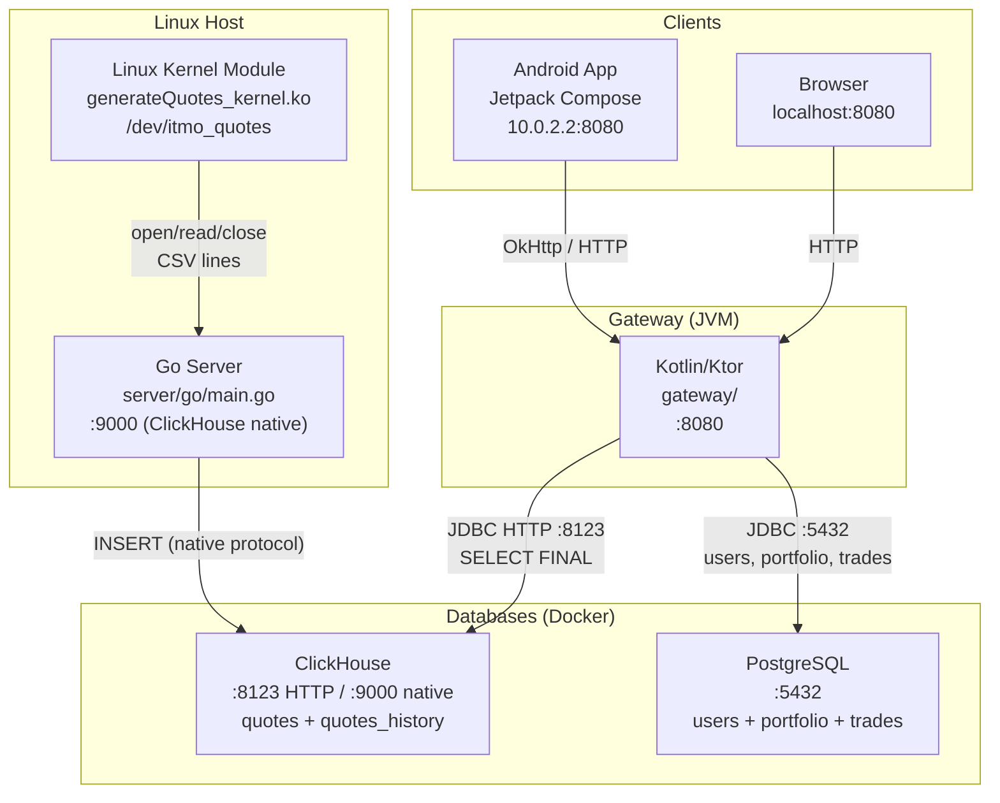
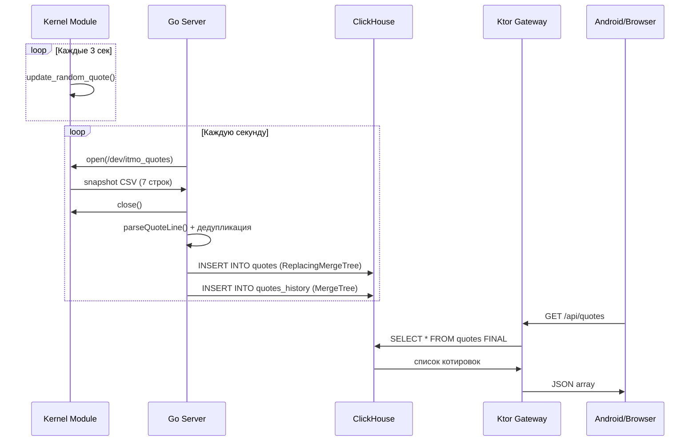
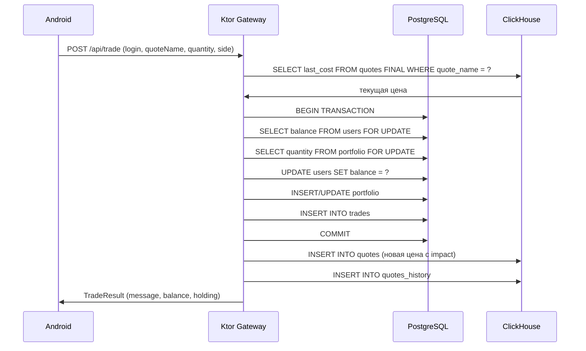
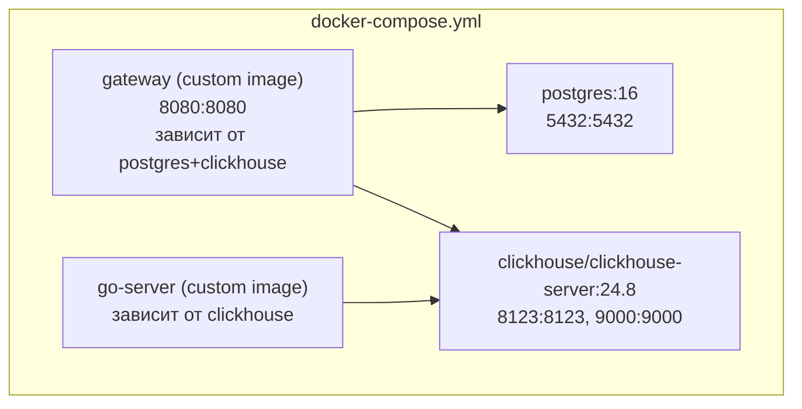

# 01 — Архитектура

#docs #architecture

## Обзор компонентов

Система состоит из 4 независимых компонентов, связанных через HTTP API и напрямую через базы данных.

## Компоненты

### 1. Linux Kernel Module (`server/drivers/`)

Реализован как misc-устройство `/dev/itmo_quotes`. Содержит массив из 7 котировок (GAZ, YANDEX, SBER, LUKOIL, ROSNEFT, VTBR, MOEX). Фоновый kthread (`generator`) каждые 3 секунды обновляет случайную котировку. При `open()` формирует текстовый снимок всех котировок в формате `NAME,PRICE,TIMESTAMP` и сохраняет его как `file->private_data`. `read()` копирует данные в userspace. `release()` освобождает память снимка.

**Источник:** `server/drivers/generateQuotes_kernel.c`

### 2. Go Server (`server/go/`)

Читает котировки из источника (символьное устройство или файл), парсит CSV и записывает в ClickHouse. Дедупликация через in-memory `seen map[string]string` — ключ `name`, значение `price@unixTimestamp`. Запись происходит только при изменении цены или временной метки.

**Источник:** `server/go/main.go`

### 3. Kotlin/Ktor Gateway (`gateway/`)

HTTP-сервер на Netty. Два соединения с БД:
- ClickHouse — через JDBC HTTP + HikariCP (пул 4 соединения) — только котировки
- PostgreSQL — через прямой JDBC (без пула на уровне gateway, `DriverManager.getConnection()`) — пользователи, портфель, сделки

**Источник:** `gateway/src/main/kotlin/`

### 4. Android App (`android/`)

Нативное приложение на Kotlin + Jetpack Compose. HTTP-клиент на OkHttp с корутинами. `BASE_URL = http://10.0.2.2:8080` (эмулятор → хост).

**Источник:** `android/app/src/main/java/com/trading/android/`

---

## Data Flow

### Путь котировки (от kernel до UI)

### Путь торговой операции

---

## Архитектурные слои

| Слой | Компоненты | Технология |
|---|---|---|
| **Data Source** | `generateQuotes_kernel.c` | Linux C |
| **Data Pipeline** | `server/go/main.go` | Go |
| **Storage** | ClickHouse, PostgreSQL | SQL |
| **API** | `gateway/src/main/kotlin/` | Kotlin/Ktor |
| **Client** | `android/app/` | Android/Compose |
| **Infrastructure** | `docker-compose.yml`, Dockerfiles | Docker |

---

## Важные архитектурные решения

### Разделение БД по ответственности

ClickHouse хранит **только котировки** (time-series). PostgreSQL хранит **только данные пользователей** (users, portfolio, trades). Это разделение позволяет масштабировать каждую базу независимо.

См. [[decisions/ADR-001-dual-database]]

### ReplacingMergeTree для котировок

Таблица `quotes` использует `ReplacingMergeTree(version)`. При запросе `SELECT FINAL` ClickHouse автоматически возвращает только актуальную версию котировки. Go-сервер каждый раз вставляет новую строку с увеличенным `version`.

См. [[decisions/ADR-002-clickhouse-engine]]

### Go как отдельный инжестор

Go-сервис изолирован от gateway. Это позволяет перезапускать инжестор независимо и избавляет JVM-приложение от блокирующего I/O с устройством ядра.

См. [[decisions/ADR-003-go-ingestor]]

### Упрощённая авторизация

Торговые API принимают `login` как query/form параметр без JWT/сессий. Это учебное ограничение MVP.

См. [[decisions/ADR-004-auth-simplification]]

---

## Deployment Diagram

---

## Связанные документы

- [[00-Overview]]
- [[07-Database]]
- [[06-API]]
- [[10-Deployment]]
- [[decisions/ADR-001-dual-database]]
