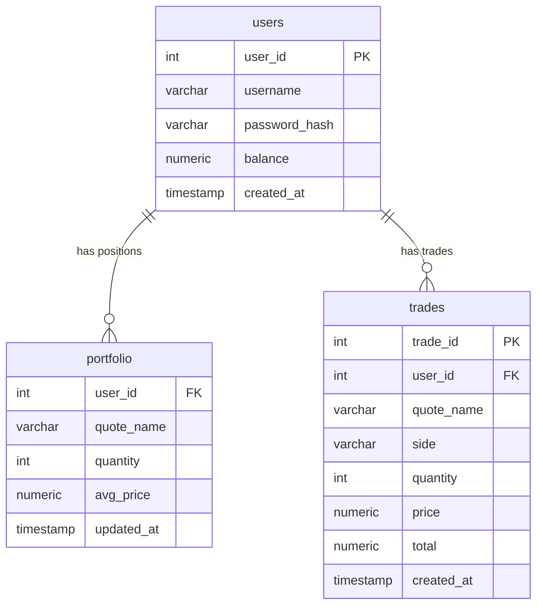

# 07 — Базы данных

#docs #database

## Архитектура хранения

Проект использует **две базы данных** с чётким разделением ответственности:

| БД | Хранит | Клиент | Порт |
|---|---|---|---|
| **ClickHouse** | Котировки (time-series) | Gateway (JDBC HTTP), Go (native) | 8123, 9000 |
| **PostgreSQL** | Пользователи, портфель, сделки | Gateway (JDBC) | 5432 |

---

## ClickHouse

### Таблица `quotes`

Актуальные котировки. Используется `ReplacingMergeTree(version)` — при дублирующих записях с одинаковым `quote_name` ClickHouse оставляет строку с наибольшим `version`.

```sql
CREATE TABLE IF NOT EXISTS quotes (
    quote_name       String,
    last_cost        Int32,
    min_cost         Int32,
    max_cost         Int32,
    percentage_change Float64,
    created_at       DateTime DEFAULT now(),
    updated_at       DateTime DEFAULT now(),
    version          UInt64
)
ENGINE = ReplacingMergeTree(version)
ORDER BY quote_name;
```

**Запрос актуальных данных:**
```sql
SELECT * FROM quotes FINAL ORDER BY quote_name;
```

> [!NOTE]
> Ключевое слово `FINAL` применяет дедупликацию немедленно. Без `FINAL` могут вернуться устаревшие версии.

**Кто создаёт:**
- `server/go/main.go` → `ensureSchema()` — при старте Go-сервера
- `gateway/src/main/kotlin/database/ClickHouseManager.kt` → `ensureQuotesTable()` — при инициализации gateway

**Кто пишет:**
- Go-сервер: `saveQuote()` — при изменении цены
- `TradingRepository.appendMarketPrice()` — при торговой операции (market impact)

**Кто читает:**
- `QuoteRepository.getQuotesDB()` — `SELECT FINAL`
- `TradingRepository.currentPrice()` — цена для торговли
- `TradingRepository.currentPrices()` — все цены для портфеля

---

### Таблица `quotes_history`

Полная история изменений цен. Используется `MergeTree()`.

```sql
CREATE TABLE IF NOT EXISTS quotes_history (
    quote_name  String,
    price       Int32,
    happened_at DateTime,
    version     UInt64
)
ENGINE = MergeTree()
ORDER BY (quote_name, happened_at, version);
```

**Кто пишет:**
- Go-сервер: `saveQuoteHistory()` — при каждом изменении цены
- `TradingRepository.appendMarketPrice()` — при каждом рыночном движении

**Кто читает:**
- `TradingRepository.quoteHistoryRows()` — последние 30 записей для history/candles

---

## PostgreSQL

### Таблица `users`

Создаётся Flyway миграцией `V1__create_users.sql`.

```sql
CREATE TABLE users (
    user_id       SERIAL PRIMARY KEY,
    username      VARCHAR(50) UNIQUE NOT NULL,
    password_hash VARCHAR(255) NOT NULL,
    balance       NUMERIC(18, 2) DEFAULT 1000000.00,  -- после V3
    created_at    TIMESTAMP DEFAULT CURRENT_TIMESTAMP
);
```

> [!NOTE]
> V1 создаёт `balance INTEGER DEFAULT 0`. V3 изменяет тип на `NUMERIC(18,2)` и устанавливает дефолт 1 000 000. V4 обновляет `balance = 1000000.00` у пользователей с `balance = 0`.

**Кто пишет:**
- `Register.register()` — `INSERT INTO users (username, password_hash)`
- `TradingRepository.trade()` — `UPDATE users SET balance = ?`

**Кто читает:**
- `Authorization.authorization()` — `SELECT password_hash`
- `TradingRepository.account()` — `SELECT balance`
- `TradingRepository.portfolio()` — JOIN с portfolio

---

### Таблица `portfolio`

Текущие позиции пользователей. Создаётся `V3__portfolio_and_trades.sql`.

```sql
CREATE TABLE IF NOT EXISTS portfolio (
    user_id    INTEGER NOT NULL REFERENCES users(user_id) ON DELETE CASCADE,
    quote_name VARCHAR(32) NOT NULL,
    quantity   INTEGER NOT NULL CHECK (quantity >= 0),
    avg_price  NUMERIC(18, 2) NOT NULL DEFAULT 0,
    updated_at TIMESTAMP DEFAULT CURRENT_TIMESTAMP,
    PRIMARY KEY (user_id, quote_name)
);
```

**Кто пишет:**
- `TradingRepository.trade()` — `INSERT ... ON CONFLICT DO UPDATE`

**Кто читает:**
- `TradingRepository.portfolio()` — JOIN с users

---

### Таблица `trades`

История торговых операций. Создаётся `V3__portfolio_and_trades.sql`.

```sql
CREATE TABLE IF NOT EXISTS trades (
    trade_id   SERIAL PRIMARY KEY,
    user_id    INTEGER NOT NULL REFERENCES users(user_id) ON DELETE CASCADE,
    quote_name VARCHAR(32) NOT NULL,
    side       VARCHAR(4) NOT NULL CHECK (side IN ('BUY', 'SELL')),
    quantity   INTEGER NOT NULL CHECK (quantity > 0),
    price      NUMERIC(18, 2) NOT NULL,
    total      NUMERIC(18, 2) NOT NULL,
    created_at TIMESTAMP DEFAULT CURRENT_TIMESTAMP
);
```

**Кто пишет:**
- `TradingRepository.trade()` — `INSERT INTO trades`

**Кто читает:**
- Не обнаружено в текущем коде (история сделок не отображается в UI)

---

## Схема связей



---

## Миграции (Flyway)

**Расположение:** `gateway/src/main/resources/db/migration/`

| Файл | Описание |
|---|---|
| `V1__create_users.sql` | Создание таблицы `users` с `balance INTEGER DEFAULT 0` |
| `V3__portfolio_and_trades.sql` | Изменение типа balance, создание `portfolio` и `trades` |
| `V4__restore_demo_balance.sql` | Установка баланса 1 000 000 для пользователей с 0 |
| `V5__portfolio_avg_price_compatibility.sql` | Добавление `avg_price` если колонки нет |

> [!WARNING]
> Файла `V2` нет — возможно, был удалён в процессе разработки. Flyway выполняет миграции по порядку версий, пропуск V2 не является ошибкой.

**Применение миграций:**
```bash
cd gateway && ./gradlew flywayMigrate --no-daemon
```

В Docker — автоматически через `entrypoint.sh` при старте контейнера.

---

## Подключение в коде

### ClickHouse (Gateway)

```kotlin
// ClickHouseManager.kt — HikariCP pool
ClickHouseManager.getConnection().use { conn ->
    conn.prepareStatement("SELECT * FROM quotes FINAL").use { ps ->
        ps.executeQuery().use { rs -> /* ... */ }
    }
}
```

### PostgreSQL (Gateway)

```kotlin
// TradingRepository.kt — прямой DriverManager
DriverManager.getConnection(postgresUrl, postgresUser, postgresPassword).use { conn ->
    conn.autoCommit = false
    // ...транзакция...
    conn.commit()
}
```

### ClickHouse (Go Server)

```go
// main.go — native protocol через clickhouse-go/v2
db, err := sql.Open("clickhouse", connectionURL.String())
row := db.QueryRow("SELECT ... FROM quotes FINAL WHERE quote_name = ?", name)
```

---

## Связанные документы

- [[01-Architecture]]
- [[05-Development-Guide]]
- [[decisions/ADR-001-dual-database]]
- [[decisions/ADR-002-clickhouse-engine]]
