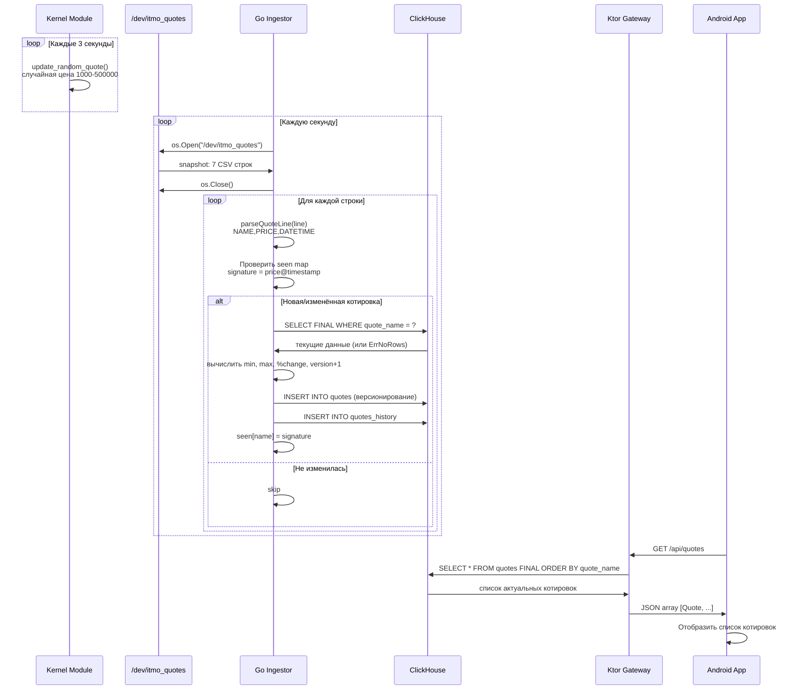

# Flow: Путь котировки от генерации до UI

#docs #flow

## Цель сценария

Котировка, сгенерированная Linux kernel module, должна появиться в Android-приложении пользователя.

## Участники

| Участник | Компонент |
|---|---|
| Kernel Module | `server/drivers/generateQuotes_kernel.c` |
| Go Ingestor | `server/go/main.go` |
| ClickHouse | База данных (tables: `quotes`, `quotes_history`) |
| Ktor Gateway | `gateway/src/main/kotlin/` |
| Android App | `android/app/` |

## Пошаговое описание

## Файлы и модули

| Шаг | Файл | Функция |
|---|---|---|
| Генерация | `server/drivers/generateQuotes_kernel.c` | `update_random_quote()`, `generator()` |
| Чтение | `server/go/main.go` | `readSnapshot()` |
| Парсинг | `server/go/main.go` | `parseQuoteLine()` |
| Дедупликация | `server/go/main.go` | `processSnapshot()` |
| Запись | `server/go/main.go` | `saveQuote()`, `saveQuoteHistory()` |
| Чтение API | `gateway/src/main/kotlin/quotes/QuoteReposetory.kt` | `getQuotesDB()` |
| HTTP endpoint | `gateway/src/main/kotlin/Routing.kt` | `configureRouting()` |
| Android UI | `android/app/src/main/java/com/trading/android/` | `ApiClient.getQuotes()` |

## Временные характеристики

- Kernel: обновляет **одну случайную** котировку каждые 3 секунды
- Go-инжестор: опрашивает источник каждую **1 секунду**
- Android: обновляет список при каждом запуске экрана котировок (`LaunchedEffect(Unit)`)

## Ошибки и альтернативные пути

| Сбой | Поведение |
|---|---|
| Kernel module не загружен | Go: `open /dev/itmo_quotes: no such file` → логирует и ждёт 1 сек |
| Некорректная строка CSV | Go: логирует предупреждение, пропускает строку |
| ClickHouse недоступен | Go: `log.Printf` + retry через 1 сек |
| Цена не изменилась | Go: seen map → строка пропускается (нет записи в CH) |
| Gateway не запущен | Android: `ApiResult.Error("Ошибка сети")` |

## Связанные документы

- [[../modules/kernel-module]]
- [[../modules/go-server]]
- [[../modules/gateway]]
- [[../07-Database]]
- [[../01-Architecture]]
