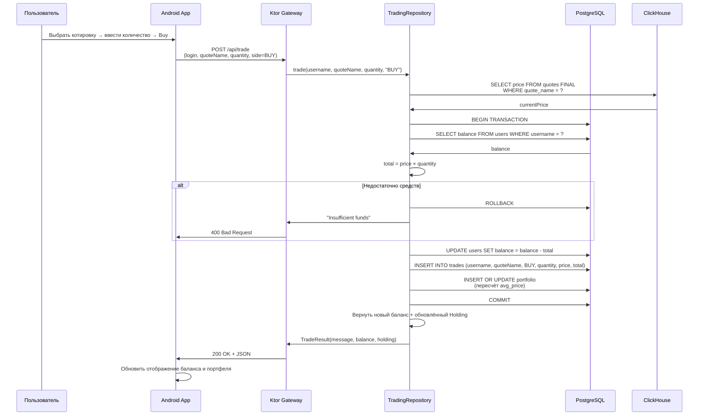
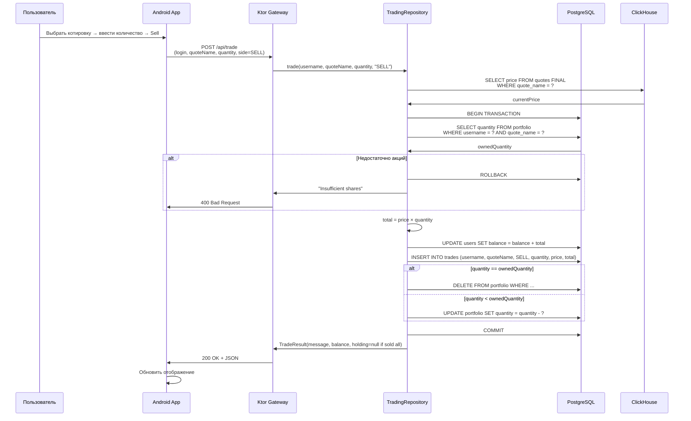
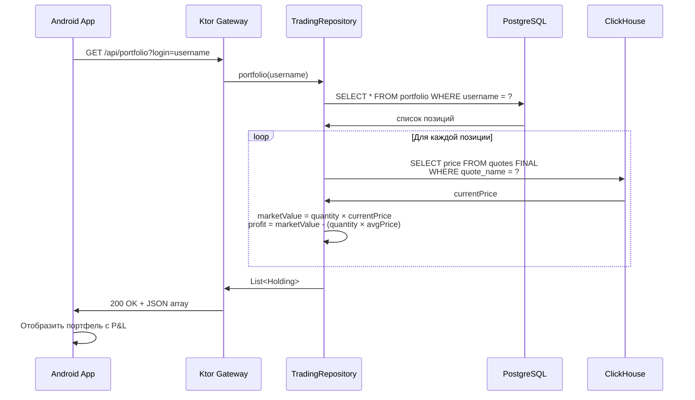

# Flow: Покупка и продажа акций

#docs #flow #trading

## Цель сценария

Авторизованный пользователь совершает торговую операцию — покупает или продаёт акции.

## Участники

| Участник | Компонент |
|---|---|
| Пользователь | Android App |
| Gateway (Ktor) | `gateway/src/main/kotlin/trading/` |
| TradingRepository | `TradingRepository.kt` |
| PostgreSQL | Таблицы `users`, `portfolio`, `trades` |
| ClickHouse | Таблица `quotes` (текущие цены) |

## Покупка (BUY)



## Продажа (SELL)



## Просмотр портфеля



## Файлы участвующие в flow

| Файл | Роль |
|---|---|
| `gateway/src/main/kotlin/trading/TradingRoutes.kt` | HTTP endpoint `POST /api/trade` |
| `gateway/src/main/kotlin/trading/TradingRepository.kt` | Транзакционная бизнес-логика |
| `gateway/src/main/kotlin/trading/TradingModels.kt` | `TradeResult`, `Holding`, `AccountSummary` |
| `gateway/src/main/kotlin/database/DataBaseManager.kt` | PostgreSQL JDBC соединение |
| `gateway/src/main/kotlin/database/ClickHouseManager.kt` | ClickHouse соединение (текущие цены) |
| `android/app/src/main/java/com/trading/android/ApiClient.kt` | `trade()`, `getPortfolio()`, `getAccount()` |
| `android/app/src/main/java/com/trading/android/MainActivity.kt` | Quote Details экран с формой торговли |

## Алгоритм пересчёта avg_price при покупке

```
Если позиция уже существует:
  newQty = existingQty + buyQty
  newAvgPrice = (existingQty × existingAvgPrice + buyQty × currentPrice) / newQty
  UPDATE portfolio SET quantity = newQty, avg_price = newAvgPrice

Если позиции нет:
  INSERT INTO portfolio (username, quote_name, quantity, avg_price)
  VALUES (?, ?, buyQty, currentPrice)
```

## Ошибки и альтернативные пути

| Сбой | HTTP-код | Сообщение |
|---|---|---|
| Недостаточно средств | 400 | "Insufficient funds" |
| Недостаточно акций | 400 | "Insufficient shares" |
| Котировка не найдена | 400 | "Quote not found" |
| Неверный side | 400 | Ошибка парсинга |
| PostgreSQL недоступен | 500 | Exception |
| ClickHouse недоступен | 500 | Exception |

## Открытые вопросы

1. Нет частичного выполнения ордеров — только полная покупка/продажа.
2. Цена фиксируется в момент запроса к ClickHouse, нет защиты от проскальзывания.
3. Нет истории ордеров в UI — только в таблице `trades`.

## Связанные документы

- [[../06-API]] — описание POST /api/trade
- [[../07-Database]] — схема portfolio и trades
- [[../modules/gateway]] — TradingRepository
- [[../modules/android-app]] — trade() метод
