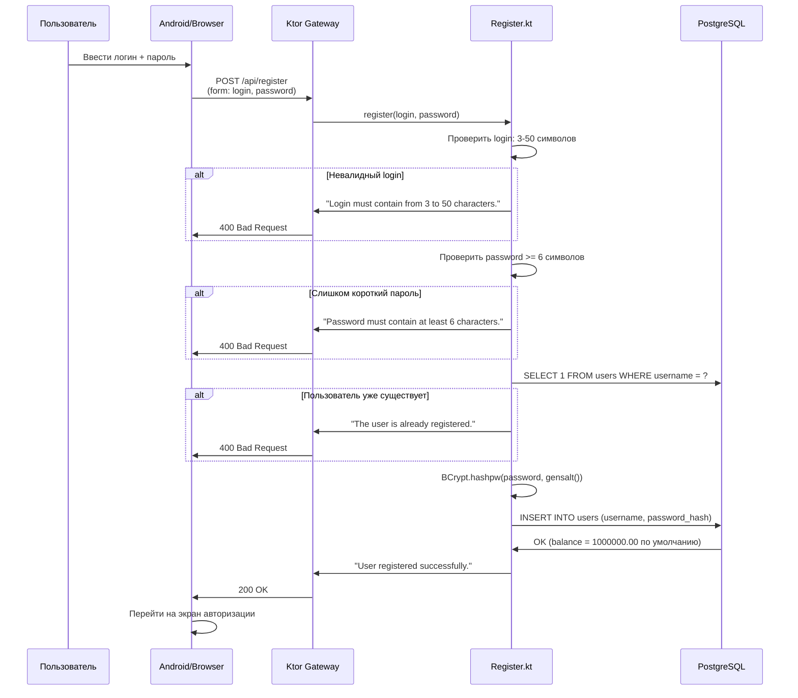
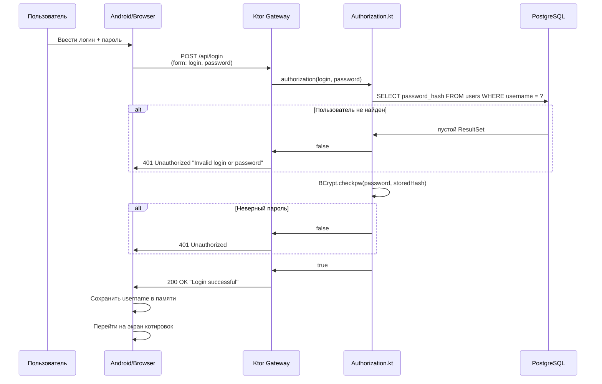

# Flow: Регистрация и вход пользователя

#docs #flow #auth

## Цель сценария

Новый пользователь регистрируется в системе и получает доступ к торговым операциям.

## Участники

| Участник | Компонент |
|---|---|
| Пользователь | Android App / Browser |
| Gateway (Ktor) | `gateway/src/main/kotlin/users/` |
| PostgreSQL | Таблица `users` |

## Регистрация

## Вход (авторизация)

## Файлы участвующие в flow

| Файл | Роль |
|---|---|
| `gateway/src/main/kotlin/users/RegisterRoutes.kt` | HTTP endpoints `/register`, `/api/register`, `/authorization`, `/api/login` |
| `gateway/src/main/kotlin/users/Register.kt` | Бизнес-логика регистрации |
| `gateway/src/main/kotlin/users/Authorization.kt` | Проверка пароля через BCrypt |
| `gateway/src/main/kotlin/database/DataBaseManager.kt` | PostgreSQL JDBC соединение |
| `gateway/src/main/resources/db/migration/V1__create_users.sql` | Схема таблицы users |
| `android/app/src/main/java/com/trading/android/ApiClient.kt` | `register()`, `login()` |
| `android/app/src/main/java/com/trading/android/MainActivity.kt` | Login экран |

## Ошибки и альтернативные пути

| Сбой | HTTP-код | Сообщение |
|---|---|---|
| Login < 3 или > 50 символов | 400 | "Login must contain from 3 to 50 characters." |
| Password < 6 символов | 400 | "Password must contain at least 6 characters." |
| Username уже занят | 400 | "The user is already registered." |
| Неверный пароль при входе | 401 | "Invalid login or password" |
| PostgreSQL недоступен | 500 / Exception | Исключение логируется |

## Открытые вопросы

1. После регистрации нет автоматического входа — пользователь перенаправляется на форму входа.
2. Нет подтверждения email.
3. Нет возможности сменить пароль.

## Связанные документы

- [[../08-Authentication-and-Authorization]]
- [[../06-API]]
- [[../07-Database]]
